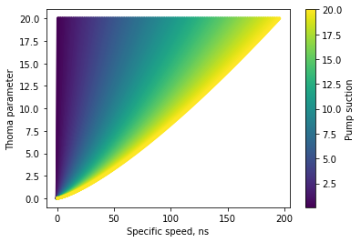

.. _meth-turbopump:

Turbopump
---------
The below methodology defines equations for the turbopump steady-state 
and transient analysis including vital material parameters and built-in package capabilities.
The general system methodology was obtained from :ref:`W. Emrich<turbopump-references>`, and somewhat complemented by 
:ref:`D. Nikitaev (2022)<turbopump-references>`.

However, the complete set of equations for treating the pump and turbine solutions can be found in:

- :ref:`Pump description in O.E. Balje (Part A)<turbopump-references>`
- :ref:`Turbine description in O.E. Balje (Part B)<turbopump-references>`

The following links also include the summary of the required equations directly taken from Balje's references (part A+B):

- :ref:`Pump <meth-pump>`: governing expressions for generating pump properties
- :ref:`Turbine <meth-turbine>`: governing expressions for generating turbine properties

However, the practical implementation relied on the interactive figures provided in :ref:`W. Emrich<turbopump-references>` book.
Specifically, the following figures were used:

- Figure 10.4: Correlation of cavitation with pump suction specific speed.

- Figure 10.5: Representative ns-ds diagram for pumps.

.. image:: figures/pumpeff.png

- Figure 10.8: Geometric stress factors for axial turbine rotor.

.. image:: figures/axialstresses.png

- Figure 10.9: Geometric stress factors for radial turbine rotor.

.. image:: figures/radialstresses.png

- Figure 10.10: Representative ns-ds diagram for turbines.

The properties ascertained from the figures above are vital for the development of a turbopump that optimizes performance
for the user-defined system. The usage of the aforementioned properties are described in further detail in the following
sections.

**Steady State Pump**

~~~~~~~~~~~~~~~~~

The pump provides the necessary pressure inside the chamber enabling the nozzle to produce
thrust while also enabling the operation of the turbines by surmounting the frictional and 
acceleration pressure losses throughout the engine channels. 
:ref:`Nikitaev, Smith, and Palomares, 2022<turbopump-references>` Section II.A outlines
the manner of computing the steady state performance of the pump.

.. math::

	\dot{m_p} =  \frac{\dot{m}}{NP}

where,
:math:`\dot{m_p}` is the mass flow rate in the pump [kg/s],
:math:`\dot{m}` is the mass flow rate of the system [kg/s], and
:math:`NP` is the number of pumps in the system.

Cavitation can occur within the pump, particularly when the pressure at the pump inlet is lower
than the vapor pressure of the fluid. Therefore, a check is done to ensure that the minimum inlet pressure
(based on a given margin of typically 10% of inlet pressure) is greater than that of the vapor pressure.
One parameter that can be used to determine if cavitation will occur is
with the suction specific speed, :math:`s_s`, which if greater than 5.0 means cavitation will likely occur.

.. math::

	s_s = \frac{\omega \rho^\frac{1}{4} \sqrt{\dot{m_p}}}{(P_{in} - P_v)^\frac{3}{4}}  

The defining parameters for the suction specific speed are
:math:`P_{in}` which is the inlet pressure [Pascals],
:math:`P_v` which is the coolant vaporization pressure [Pascals],
:math:`\rho` is the density of the hydrogen as a function of inlet temperature, and
:math:`\omega` is the shaft speed of the pump [rad/s].

The inlet enthalpy, vapor pressure, and density for the pump are evaluated from the inlet pressure and temperature.
The pump head [m] is then found:

.. math::

	H_p = \frac{P_{out} - P_{in}}{g \rho_{in}}

where :math:`g` is the gravitational constant, 9.80665 [:math:`\frac{m}{s^2}`].
The functionality produces additional parameters for use in solutions for other components such as the 
volumetric flow rate in the pump [:math:`\frac{m^3}{s}`] and the Thoma cavitation parameter (:math:`\sigma_{cav}`):

.. math::

	\dot{V} = \frac{\dot{m_p}}{\rho_{in}}

.. math::

	\sigma_{cav} = \frac{H_{sr}}{H_p}
	
	
where :math:`H_{sr}` represents the net-positive suction head (NPSH) required by the pump to prevent cavitation.

.. math::

	H_{sr} = \frac{P_{in_{min}} - P_v}{\rho_{in} g}

Thoma is displayed in Figure 10.4 and is used along with the suction specific speed to determine the maximum 
pump specific speed. Additionally, the rotor speed, :math:`\omega` [rad/s] and impeller diameter are found:

.. math::
	
	\omega = \frac{n_{sp} (g H_p)^\frac{3}{4} }{ \sqrt{\dot{V}} }
	
	
.. math::

	D = \frac{ d_{sp} \sqrt{\dot{V}} }{ (g H_p)^\frac{1}{4} }
	
:math:`n_{sp}` represents the pump specific speed which is based on the pump type used (Radial, Francis, Mixed, Axial, etc).
Finally, the work done by the pump can be found while the work necessary to drive the pump is equivalent
to :math:`W_p` divided by the pump's efficiency.

.. math::

	W_p = \dot{V} (P_{out} - P_{in})

The enthalpy found after passing through the pump is then found using the pump work:

.. math::

	h_{out} = \frac{h_{in} + (\dot{V}_{in} + W_P)}{\dot{m_p}}
	

**Steady State Turbine**

~~~~~~~~~~~~~~~~~

The methodology for determining the steady state properties of the turbine was established by :ref:`W. Emrich<turbopump-references>`.
Here, the head across the turbine is found using the inlet and outlet enthalpies:

.. math::

	H_t = \frac{ h_{in} - h_{out} }{g}

Note: The package contains the capability of implementing a gear ratio between the pump and turbine where turbine speed is the product of pump speed and gear ratio.
The resulting property (turbine diameter/speed based on input provided) is a function of the material, stress factor, and safety factor.

The turbine specific speed and diameters are found using the aforementioned head:

.. math::

	n_{st} = \frac{ \omega \sqrt{\dot{V}} }{ (g H_t)^\frac{3}{4} }

	d_{st} = \frac{ D_t (g H_t)^\frac{1}{4} }{\sqrt{\dot{V}}}

	

The overall work that is done by the turbine is then found along with the mass flow rate through the turbine:

.. math::

	W_t = \eta_t \dot{V} \rho (h_{in} - h_{out})
	
	\dot{m_t} = \rho \dot{V}

**Turbopump Design**

~~~~~~~~~~~~~~~~

The maximum component diameter can be found:

.. math::

	D_{max} = \sqrt{\frac{4 \sigma_y}{\xi S \rho_r \omega^2}}

where,
:math:`\sigma_y` is the yield stress.
If the diameter is greater than the maximum diameter, then the material will fail.
Depending on the parameter solved for throughout the steady-state process the rotor speed and maximum
diameter can be interchanged.

The propellant in the turbine portion is normally in a gaseous form; having a relatively low density
due to its gaseous state. As the objective is to maximize the turbine's efficiency, the volume flow rate of the
propellant through the turbine should be higher than that in the pump assembly.
High propellant volume flow rates will require high rotor speeds resulting in high rotor stress levels due to centrifugal
forces.

Therefore, it may be necessary to
operate the turbine at rotor speeds less than optimal in order to reduce the rotor disk and blade root
stresses to acceptable values. :ref:`Emrich, 2016<turbopump-references>` Chapter 10, eq. 10.7
explains how the stress values may be calculated to ensure the rotor disk and blade root stresses
are held within acceptable thresholds.

.. math::

	\sigma = \xi S \rho_r \omega^2 \left( \frac{D}{2} \right)^2

here, 
:math:`\sigma` is the rotor stress [Pascals], 
:math:`\xi` is the safety factor,
:math:`S` is the rotor shape/geometric factor, 
:math:`\omega` is the rotational speed [rad/s], and
:math:`D` is the diameter of the pump or turbine.
:math:`\rho_r` is the rotor material density which is taken from a lookup material database.

**Materials**

~~~~~~~~~~~~~~~~

The package has built-in data references utilized from :ref:`Nikitaev, Smith, and Palomares, 2022<turbopump-references>` Tables I and II.
The corresponding data values are listed below:

.. csv-table:: *Turbine and Pump Data*
   :header: Turbine Yield Stress,Pump Yield Stress,Density,Material
   :stub-columns: 0
   :align: center

   207e+6,344e+6,8060,Stainless Steel
   276e+6,372e+6,2700,Aluminum
   140e+6,300e+6,8730,Brass
   125e+6,372e+6,8900,Bronze
   550e+6,1241e+6,8192,Inconcel
   240e+6,1240e+6,4500,Titanium

The package also enables the user to input their own material.
The inputs for the new material are:
material name, density [:math:`\frac{kg}{m^3}`], yield stress [Pascals], and type ("pump"/"turbine").

.. _turbopump-references:

References
----------

O.E. Balje, "A study on design criteria and matching of turbomachines Part A: Similarity Relations and Design of Turbines", Journal of Engineering for Power, (1962).

O.E. Balje, "A study on design criteria and matching of turbomachines Part B: Compressor and Pump Performance and Matching of Turbocomponets", Journal of Engineering for Power, (1962).

W. Emrich, "Principles of Nuclear Rocket Propulsion", (2016).

D. Nikitaev, C. D. Smith, K. Palomares, "Nuclear Thermal Propulsion Turbomachinery Modeling", Proc. of NETS2022, (2022).

V. Manickam, "A REDUCED ORDER TRANSIENT SYSTEM MODEL FOR LOW ENRICHED URANIUM NUCLEAR THERMAL PROPULSION ENGINES", Georgia Tech, (2022).